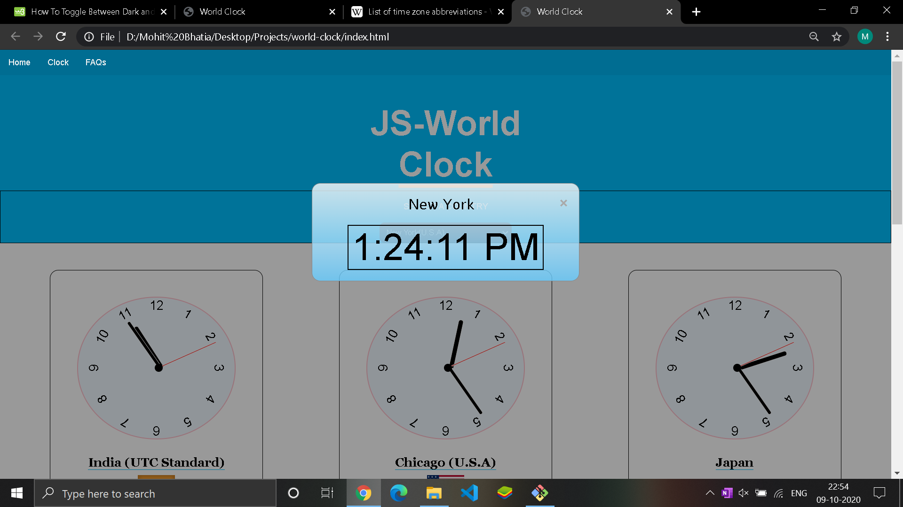

## Steps to Contribute

1. Fork the repository

2. Clone your forked repository using terminal or gitbash.

```
git clone <link-of-repos>
```

3. Make changes to the cloned repos

4. Run the following three commands

```
git add .
git commit -m "Your-msg-here"
git push origin master
```

5. Then in github , in your cloned repository find the option to make a pull request

<b> Successfully you have created a PR </b> :smiley:

# Worldclock


[description](#description) - [technologies](#technologies) - [installaion](#installation)

## Description

It is a web app which tells the user about the respective countries as one hovers over the world map or select a particular country from the
dropdown list. It shows the time in digital format.

## Technologies

- HTML
- CSS
- JAVASCRIPT

## Installation

- Fork the repo to your remote repo
- Download the repo to your local system
- Navigate to the path where you downloaded the repo
- Open index.html with the browser


# world-clock

It is a web app that lets the user see the current time of a country.

## Description

It is an web app which tells the user about the respective countries as one hovers over the world map or select a particular country from the
dropdown list. It shows the time in digital format.

## Technologies Used

-   HTML
-   CSS
-   JAVASCRIPT

## How to Install

-   Fork the repo to your remote repo
-   Download the repo to your local system
-   Navigate to the path where you downloaded the repo
-   Open index.html with the browser

## Screenshots




